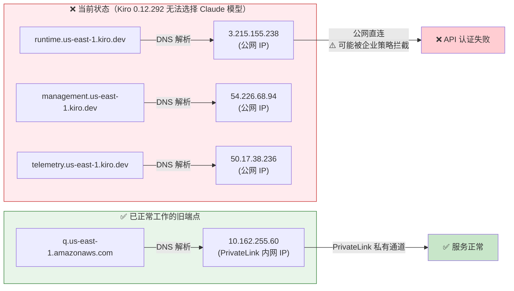
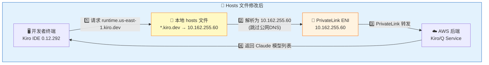
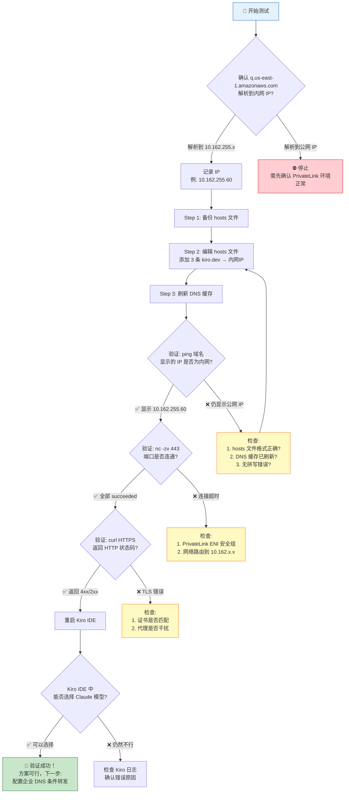

# Kiro 域名 Hosts 文件修改测试指南 — 复用 PrivateLink 通道验证

> **目标**：通过修改本地 hosts 文件，将 Kiro 新版本 3 个 `*.kiro.dev` 域名强制解析到已有 Amazon Q PrivateLink 端点的内网 IP，验证 Kiro IDE 0.12.292 能否正常选择 Claude 模型。

---

## 一、问题背景



### 核心原因

| 域名 | 当前解析 | 走向 | 结果 |
|------|---------|------|------|
| `q.us-east-1.amazonaws.com` | `10.162.255.60`（内网） | PrivateLink 私有通道 | ✅ 正常 |
| `runtime.us-east-1.kiro.dev` | `3.x.x.x`（公网） | 企业公网出口 | ❌ 无法认证 |
| `management.us-east-1.kiro.dev` | `54.x.x.x`（公网） | 企业公网出口 | ❌ 无法认证 |
| `telemetry.us-east-1.kiro.dev` | `50.x.x.x`（公网） | 企业公网出口 | ❌ 无法认证 |

---

## 二、解决方案原理



> **一句话总结**：修改 hosts 文件，将 3 个 kiro.dev 域名强制指向已验证可用的 PrivateLink 内网 IP `10.162.255.60`，使 Kiro IDE 的 HTTPS 请求走 PrivateLink 私有通道到达 AWS 后端。

---

## 三、操作步骤（macOS / Linux）

> 💡 **Windows 用户**：请直接跳转到末尾「附录: Windows 操作指南」，以下为 macOS / Linux 操作。

### ⚠️ 前提条件

- 确认当前环境 `q.us-east-1.amazonaws.com` 解析到内网 IP 且工作正常
- 获取该内网 IP（本例为 `10.162.255.60`）

```bash
# 先确认当前可用的 PrivateLink IP
dig +short q.us-east-1.amazonaws.com
# 预期输出: 10.162.255.60 (或 10.162.255.38)
```

---

### 3.1 macOS 操作

#### Step 1: 备份 hosts 文件

```bash
sudo cp /etc/hosts /etc/hosts.backup.$(date +%Y%m%d_%H%M%S)
```

#### Step 2: 编辑 hosts 文件

```bash
sudo nano /etc/hosts
```

在文件末尾添加以下内容：

```
# ============================================================
# Kiro PrivateLink 测试 - 将 kiro.dev 域名指向已有 PrivateLink ENI
# 添加时间: 2026-06-05
# 目的: 验证 Kiro IDE 0.12.292 通过 PrivateLink 通道正常工作
# ============================================================
10.162.255.60    runtime.us-east-1.kiro.dev
10.162.255.60    management.us-east-1.kiro.dev
10.162.255.60    telemetry.us-east-1.kiro.dev
# ============================================================
```

> 💡 **说明**：如果 `dig +short q.us-east-1.amazonaws.com` 返回的是其他 IP（如 `10.162.255.38`），请使用那个 IP 替换上面的 `10.162.255.60`。

#### Step 3: 刷新 DNS 缓存

```bash
# macOS 刷新 DNS 缓存
sudo dscacheutil -flushcache
sudo killall -HUP mDNSResponder

# 确认命令执行成功（无报错即可）
echo "DNS cache flushed successfully"
```

---

### 3.2 Linux 操作

#### Step 1: 备份 hosts 文件

```bash
sudo cp /etc/hosts /etc/hosts.backup.$(date +%Y%m%d_%H%M%S)
```

#### Step 2: 编辑 hosts 文件

```bash
sudo vim /etc/hosts
# 或
sudo nano /etc/hosts
```

在文件末尾添加（同 macOS 内容）：

```
# ============================================================
# Kiro PrivateLink 测试 - 将 kiro.dev 域名指向已有 PrivateLink ENI
# 添加时间: 2026-06-05
# 目的: 验证 Kiro IDE 0.12.292 通过 PrivateLink 通道正常工作
# ============================================================
10.162.255.60    runtime.us-east-1.kiro.dev
10.162.255.60    management.us-east-1.kiro.dev
10.162.255.60    telemetry.us-east-1.kiro.dev
# ============================================================
```

#### Step 3: 刷新 DNS 缓存

```bash
# systemd-resolved (Ubuntu 18.04+)
sudo systemd-resolve --flush-caches

# 或 nscd
sudo systemctl restart nscd

# 或 dnsmasq
sudo systemctl restart dnsmasq
```

---

## 四、验证测试 — 确认修改成功（macOS / Linux）

> 💡 **Windows 用户**：请参考末尾「附录: Windows 操作指南」中的验证命令。

### 4.1 DNS 解析验证（所有平台通用）

```bash
# ===== 验证 1: 确认 hosts 文件生效 =====

# macOS / Linux
echo "=== 验证 DNS 解析 ==="
echo ""
echo "--- q.us-east-1.amazonaws.com (参考基线) ---"
dig +short q.us-east-1.amazonaws.com
echo ""
echo "--- runtime.us-east-1.kiro.dev ---"
dig +short runtime.us-east-1.kiro.dev
echo ""
echo "--- management.us-east-1.kiro.dev ---"
dig +short management.us-east-1.kiro.dev
echo ""
echo "--- telemetry.us-east-1.kiro.dev ---"
dig +short telemetry.us-east-1.kiro.dev
echo ""
echo "=== 预期: 所有域名均解析为 10.162.255.60 ==="
```

> ⚠️ **重要**：`dig` 命令不会读取 hosts 文件！要验证 hosts 是否生效，请使用以下命令：

```bash
# macOS / Linux — 正确的验证方式（读取 hosts 文件）
echo "=== 使用 ping 验证 hosts 解析 ==="
ping -c 1 runtime.us-east-1.kiro.dev | head -1
ping -c 1 management.us-east-1.kiro.dev | head -1
ping -c 1 telemetry.us-east-1.kiro.dev | head -1
echo ""
echo "=== 预期输出包含: (10.162.255.60) ==="
```

**预期输出格式：**
```
PING runtime.us-east-1.kiro.dev (10.162.255.60): 56 data bytes
PING management.us-east-1.kiro.dev (10.162.255.60): 56 data bytes
PING telemetry.us-east-1.kiro.dev (10.162.255.60): 56 data bytes
```

---

### 4.2 TCP 443 端口连通性验证

```bash
# macOS / Linux
echo "=== TCP 443 连通性测试 ==="
echo ""
echo "--- runtime.us-east-1.kiro.dev:443 ---"
nc -zv -w 5 runtime.us-east-1.kiro.dev 443
echo ""
echo "--- management.us-east-1.kiro.dev:443 ---"
nc -zv -w 5 management.us-east-1.kiro.dev 443
echo ""
echo "--- telemetry.us-east-1.kiro.dev:443 ---"
nc -zv -w 5 telemetry.us-east-1.kiro.dev 443
echo ""
echo "=== 预期: 所有端口 succeeded ==="
```

**预期输出：**
```
Connection to runtime.us-east-1.kiro.dev port 443 [tcp/https] succeeded!
Connection to management.us-east-1.kiro.dev port 443 [tcp/https] succeeded!
Connection to telemetry.us-east-1.kiro.dev port 443 [tcp/https] succeeded!
```


---

### 4.3 HTTPS 层验证（TLS 握手 + HTTP 响应）

```bash
# ===== 验证 2: HTTPS 连通性 =====
echo "=== HTTPS 层验证 ==="
echo ""

echo "--- runtime.us-east-1.kiro.dev ---"
curl -sI --connect-timeout 10 https://runtime.us-east-1.kiro.dev 2>&1 | head -5
echo ""

echo "--- management.us-east-1.kiro.dev ---"
curl -sI --connect-timeout 10 https://management.us-east-1.kiro.dev 2>&1 | head -5
echo ""

echo "--- telemetry.us-east-1.kiro.dev ---"
curl -sI --connect-timeout 10 https://telemetry.us-east-1.kiro.dev 2>&1 | head -5
echo ""
echo "=== 预期: 返回 HTTP 状态码 (403/404/200 均表示服务可达) ==="
```

**关键解读**：
- `HTTP 404` = TLS 握手成功 + 服务可达（只是没有匹配的路由）✅
- `HTTP 403` = TLS 握手成功 + 服务可达（需要认证）✅
- `HTTP 200` = 完全正常 ✅
- `Connection refused` 或 `timeout` = 网络不通 ❌

---

### 4.4 TLS 证书验证（确认走的是 PrivateLink）

```bash
# 验证 TLS 证书 — 确认实际连接的是 AWS 内部服务
echo "=== TLS 证书验证 ==="
echo ""

echo "--- runtime.us-east-1.kiro.dev 证书信息 ---"
echo | openssl s_client -connect runtime.us-east-1.kiro.dev:443 -servername runtime.us-east-1.kiro.dev 2>/dev/null | openssl x509 -noout -subject -issuer -dates
echo ""

echo "--- q.us-east-1.amazonaws.com 证书信息（对比基线）---"
echo | openssl s_client -connect q.us-east-1.amazonaws.com:443 -servername q.us-east-1.amazonaws.com 2>/dev/null | openssl x509 -noout -subject -issuer -dates
echo ""
echo "=== 两者应为 AWS 签发的有效证书 ==="
```

---

### 4.5 综合一键验证脚本

#### macOS / Linux 一键脚本

```bash
#!/bin/bash
# ============================================================
# Kiro PrivateLink Hosts 修改验证脚本
# 使用: chmod +x verify_kiro_hosts.sh && ./verify_kiro_hosts.sh
# ============================================================

EXPECTED_IP="10.162.255.60"
DOMAINS=(
    "runtime.us-east-1.kiro.dev"
    "management.us-east-1.kiro.dev"
    "telemetry.us-east-1.kiro.dev"
)
PASS=0
FAIL=0

echo "╔══════════════════════════════════════════════════════════╗"
echo "║  Kiro PrivateLink Hosts 验证                            ║"
echo "║  预期 IP: $EXPECTED_IP                          ║"
echo "╚══════════════════════════════════════════════════════════╝"
echo ""

# 检查 1: hosts 文件内容
echo "▶ [检查 1/4] hosts 文件内容"
echo "---"
grep -n "kiro.dev" /etc/hosts || echo "⚠️  hosts 文件中未找到 kiro.dev 条目！"
echo ""

# 检查 2: DNS 解析
echo "▶ [检查 2/4] DNS 解析验证 (ping)"
echo "---"
for domain in "${DOMAINS[@]}"; do
    RESOLVED_IP=$(ping -c 1 -t 5 "$domain" 2>/dev/null | head -1 | grep -oE '\(([0-9]+\.){3}[0-9]+\)' | tr -d '()')
    if [ "$RESOLVED_IP" == "$EXPECTED_IP" ]; then
        echo "  ✅ $domain → $RESOLVED_IP"
        ((PASS++))
    else
        echo "  ❌ $domain → $RESOLVED_IP (预期: $EXPECTED_IP)"
        ((FAIL++))
    fi
done
echo ""

# 检查 3: TCP 443 连通性
echo "▶ [检查 3/4] TCP 443 端口连通性"
echo "---"
for domain in "${DOMAINS[@]}"; do
    if nc -zw5 "$domain" 443 2>/dev/null; then
        echo "  ✅ $domain:443 → 连通"
        ((PASS++))
    else
        echo "  ❌ $domain:443 → 不通"
        ((FAIL++))
    fi
done
echo ""

# 检查 4: HTTPS 响应
echo "▶ [检查 4/4] HTTPS 响应码"
echo "---"
for domain in "${DOMAINS[@]}"; do
    HTTP_CODE=$(curl -so /dev/null -w "%{http_code}" --connect-timeout 10 "https://$domain" 2>/dev/null)
    if [ "$HTTP_CODE" != "000" ]; then
        echo "  ✅ $domain → HTTP $HTTP_CODE (服务可达)"
        ((PASS++))
    else
        echo "  ❌ $domain → 超时/无响应"
        ((FAIL++))
    fi
done
echo ""

# 汇总
echo "╔══════════════════════════════════════════════════════════╗"
echo "║  验证结果: ✅ 通过 $PASS 项  ❌ 失败 $FAIL 项              ║"
echo "╚══════════════════════════════════════════════════════════╝"

if [ $FAIL -eq 0 ]; then
    echo ""
    echo "🎉 所有验证通过！请重启 Kiro IDE 测试 Claude 模型是否可用。"
else
    echo ""
    echo "⚠️  存在失败项，请检查 hosts 文件配置或网络连接。"
fi
```

---

## 五、Kiro IDE 功能验证

完成 hosts 修改和网络验证后：

### Step 1: 重启 Kiro IDE

```bash
# macOS — 完全退出并重启 Kiro
killall Kiro 2>/dev/null
sleep 2
open -a Kiro
```

### Step 2: 验证 Claude 模型可用

1. 打开 Kiro IDE
2. 进入 Settings / Model Selection
3. **预期结果**：能看到 Claude 模型选项（Claude Sonnet 4 / Claude Haiku 等）
4. 尝试发起一次代码补全或 Chat 对话

### Step 3: 检查 Kiro 日志（如仍有问题）

```bash
# macOS — Kiro IDE 日志位置
tail -100 ~/Library/Application\ Support/Kiro/logs/main.log | grep -i "error\|fail\|connect\|kiro.dev"

# 或查看网络相关日志
tail -100 ~/Library/Application\ Support/Kiro/logs/main.log | grep -i "runtime\|management\|telemetry"
```

---

## 六、完整流程图



---

## 七、测试结果报告（汇总模板）

> **📋 请将以下内容填写完整后发送给 SA 进行分析。**

```
================================================================
  Kiro PrivateLink Hosts 验证 — 测试结果报告
  测试日期: 2026-06-__  __:__
================================================================

[1. 环境信息]
操作系统:   _________________
Kiro版本:   _________________
公网出口IP: _________________
网络环境:   _________________

[2. PrivateLink IP]
q.us-east-1.amazonaws.com:              → _________________
codewhisperer.us-east-1.amazonaws.com:  → _________________
选用IP:                                   _________________

[3. Hosts 修改]
备份文件:   _________________
修改状态:   _________________  (成功/失败)

[4. 验证结果]

  DNS 解析 (hosts 生效确认):
    runtime.us-east-1.kiro.dev:    → _________________
    management.us-east-1.kiro.dev: → _________________
    telemetry.us-east-1.kiro.dev:  → _________________

  TCP 443 端口:
    runtime:    _________________  (succeeded/failed)
    management: _________________  (succeeded/failed)
    telemetry:  _________________  (succeeded/failed)

  HTTPS 响应:
    runtime:    HTTP ___ | Time: ___s | IP: ___
    management: HTTP ___ | Time: ___s | IP: ___
    telemetry:  HTTP ___ | Time: ___s | IP: ___
    基线(q):    HTTP ___ | Time: ___s | IP: ___

  TLS 证书:
    runtime subject: _________________
    runtime issuer:  _________________
    基线(q) subject: _________________
    基线(q) issuer:  _________________

[5. Kiro IDE 功能验证]
Claude 模型可见: _________________  (是/否)
可选模型列表:    _________________
测试对话结果:    _________________  (成功/失败)
错误信息(如有):  _________________

[6. 结论]
整体结果: _________________  (✅ 全部通过 / ⚠️ 部分通过 / ❌ 失败)
备注:     _________________

================================================================
```

---

## 八、后续生产化方案

| 阶段 | 方案 | 适用场景 |
|------|------|---------|
| **本次测试** | 修改本机 hosts 文件 | 单台开发者机器快速验证 |
| **团队推广** | 企业 DNS 添加条件转发规则<br/>`*.kiro.dev → Route53 Inbound EP` | 全团队无需逐台配置 |
| **长期方案** | VPCE Private DNS 自动关联<br/>（AWS 侧已支持，需确认 VPCE 版本） | 零配置自动生效 |

---

## 九、常见问题 FAQ

### Q1: 为什么用 `dig` 看不到 hosts 文件的效果？

`dig` 直接查询 DNS 服务器，不读取本地 hosts 文件。验证 hosts 是否生效请用 `ping` 或 `python3 -c "import socket; print(socket.gethostbyname('runtime.us-east-1.kiro.dev'))"`。

### Q2: 如果有两个 PrivateLink IP（10.162.255.60 和 10.162.255.38），用哪个？

任选一个即可，两个都是同一 VPC Endpoint 的 ENI。建议选第一个返回的 IP。如果想做冗余测试，可以先用 .60，不行再试 .38。

### Q3: 修改 hosts 后 Kiro 还是不行？

排查顺序：
1. 确认 ping 解析到正确 IP
2. 确认 `nc -zv` 端口连通
3. 确认 `curl -v https://runtime.us-east-1.kiro.dev` 无 TLS 错误
4. 检查是否有本地代理（如公司 HTTP 代理）绕过了 hosts
5. 查看 Kiro IDE 日志

### Q4: macOS 上 killall mDNSResponder 报错？

部分 macOS 版本命令略有不同：
```bash
# macOS Ventura+ (13.x+)
sudo dscacheutil -flushcache; sudo killall -HUP mDNSResponder

# 如果提示进程不存在，尝试：
sudo discoveryutil mdnsflushcache
sudo discoveryutil udnsflushcaches
```

---


---

## 附录: Windows 操作指南

> **Windows 用户请参考本节**，macOS / Linux 用户可忽略。

### A.1 修改 hosts 文件（Windows）

#### Step 1: 以管理员身份打开命令提示符

```
右键 "开始菜单" → "Windows Terminal (管理员)" 或 "命令提示符 (管理员)"
```

#### Step 2: 备份 hosts 文件

```cmd
copy C:\Windows\System32\drivers\etc\hosts C:\Windows\System32\drivers\etc\hosts.backup
```

#### Step 3: 编辑 hosts 文件

```cmd
notepad C:\Windows\System32\drivers\etc\hosts
```

在文件末尾添加：

```
# ============================================================
# Kiro PrivateLink 测试 - 将 kiro.dev 域名指向已有 PrivateLink ENI
# 添加时间: 2026-06-05
# 目的: 验证 Kiro IDE 0.12.292 通过 PrivateLink 通道正常工作
# ============================================================
10.162.255.60    runtime.us-east-1.kiro.dev
10.162.255.60    management.us-east-1.kiro.dev
10.162.255.60    telemetry.us-east-1.kiro.dev
# ============================================================
```

#### Step 4: 刷新 DNS 缓存

```cmd
ipconfig /flushdns
```

预期输出：

```
Windows IP 配置
已成功刷新 DNS 解析缓存。
```

---

### A.2 验证 — DNS 解析（Windows）

```cmd
REM Windows 验证 hosts 是否生效
ping -n 1 runtime.us-east-1.kiro.dev
ping -n 1 management.us-east-1.kiro.dev
ping -n 1 telemetry.us-east-1.kiro.dev
```

**预期输出：**
```
正在 Ping runtime.us-east-1.kiro.dev [10.162.255.60] 具有 32 字节的数据:
```

---

### A.3 验证 — TCP 443 端口（Windows）

```powershell
# PowerShell
Test-NetConnection runtime.us-east-1.kiro.dev -Port 443
Test-NetConnection management.us-east-1.kiro.dev -Port 443
Test-NetConnection telemetry.us-east-1.kiro.dev -Port 443
```

---

### A.4 一键验证脚本（Windows PowerShell）

```powershell
# ============================================================
# Kiro PrivateLink Hosts 修改验证脚本 (Windows)
# 使用: 以管理员身份运行 PowerShell，执行此脚本
# ============================================================

$ExpectedIP = "10.162.255.60"
$Domains = @(
    "runtime.us-east-1.kiro.dev",
    "management.us-east-1.kiro.dev",
    "telemetry.us-east-1.kiro.dev"
)
$Pass = 0
$Fail = 0

Write-Host "╔══════════════════════════════════════════════════════════╗" -ForegroundColor Cyan
Write-Host "║  Kiro PrivateLink Hosts 验证 (Windows)                  ║" -ForegroundColor Cyan
Write-Host "║  预期 IP: $ExpectedIP                          ║" -ForegroundColor Cyan
Write-Host "╚══════════════════════════════════════════════════════════╝" -ForegroundColor Cyan
Write-Host ""

# 检查 1: hosts 文件内容
Write-Host "▶ [检查 1/3] hosts 文件内容" -ForegroundColor Yellow
Select-String -Path "C:\Windows\System32\drivers\etc\hosts" -Pattern "kiro.dev"
Write-Host ""

# 检查 2: DNS 解析
Write-Host "▶ [检查 2/3] DNS 解析验证" -ForegroundColor Yellow
foreach ($domain in $Domains) {
    try {
        $result = [System.Net.Dns]::GetHostAddresses($domain)
        $ip = $result[0].IPAddressToString
        if ($ip -eq $ExpectedIP) {
            Write-Host "  ✅ $domain → $ip" -ForegroundColor Green
            $Pass++
        } else {
            Write-Host "  ❌ $domain → $ip (预期: $ExpectedIP)" -ForegroundColor Red
            $Fail++
        }
    } catch {
        Write-Host "  ❌ $domain → 解析失败" -ForegroundColor Red
        $Fail++
    }
}
Write-Host ""

# 检查 3: TCP 443 连通性
Write-Host "▶ [检查 3/3] TCP 443 端口连通性" -ForegroundColor Yellow
foreach ($domain in $Domains) {
    $tcp = Test-NetConnection -ComputerName $domain -Port 443 -WarningAction SilentlyContinue
    if ($tcp.TcpTestSucceeded) {
        Write-Host "  ✅ ${domain}:443 → 连通 (RemoteAddress: $($tcp.RemoteAddress))" -ForegroundColor Green
        $Pass++
    } else {
        Write-Host "  ❌ ${domain}:443 → 不通" -ForegroundColor Red
        $Fail++
    }
}
Write-Host ""

# 汇总
Write-Host "╔══════════════════════════════════════════════════════════╗" -ForegroundColor Cyan
Write-Host "║  验证结果: ✅ 通过 $Pass 项  ❌ 失败 $Fail 项" -ForegroundColor Cyan
Write-Host "╚══════════════════════════════════════════════════════════╝" -ForegroundColor Cyan

if ($Fail -eq 0) {
    Write-Host "`n🎉 所有验证通过！请重启 Kiro IDE 测试 Claude 模型是否可用。" -ForegroundColor Green
} else {
    Write-Host "`n⚠️  存在失败项，请检查 hosts 文件配置或网络连接。" -ForegroundColor Red
}
```


*文档版本: V1 | 创建时间: 2026-06-05 15:10 CST | 作者: Yiming Liang*
