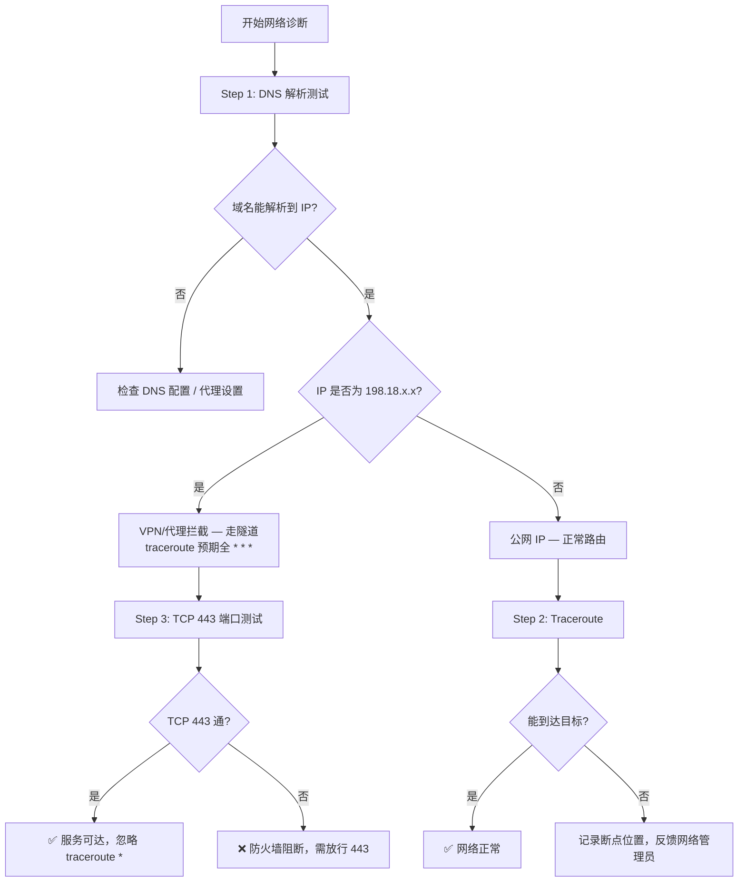
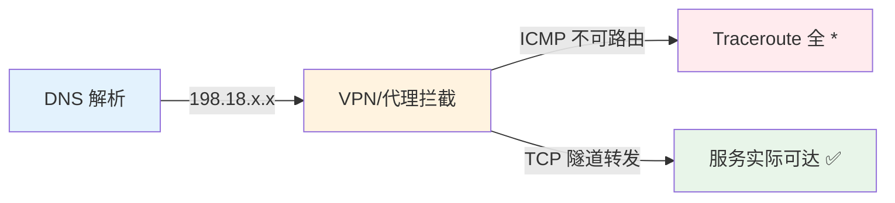

# Kiro / Amazon Q 服务端点 — Traceroute 网络连通性测试指南

> 指导客户在企业内网环境下完成 DNS 解析 + Traceroute + TCP 端口连通性测试。

---

## 测试目标域名

| 域名 | 用途 |
|------|------|
| `q.us-east-1.amazonaws.com` | Amazon Q 服务端点 |
| `codewhisperer.us-east-1.amazonaws.com` | CodeWhisperer 服务端点 |
| `runtime.us-east-1.kiro.dev` | Kiro Runtime API |
| `management.us-east-1.kiro.dev` | Kiro Management API |
| `telemetry.us-east-1.kiro.dev` | Kiro 遥测数据上报 |

---

## 诊断流程



---

## 一、Windows 测试方法

打开 **命令提示符**（`Win+R` → `cmd` → 回车）：

### Step 1 — DNS 解析

```batch
nslookup q.us-east-1.amazonaws.com
nslookup codewhisperer.us-east-1.amazonaws.com
nslookup runtime.us-east-1.kiro.dev
nslookup management.us-east-1.kiro.dev
nslookup telemetry.us-east-1.kiro.dev
```

### Step 2 — Traceroute

```batch
tracert -d q.us-east-1.amazonaws.com
tracert -d codewhisperer.us-east-1.amazonaws.com
tracert -d runtime.us-east-1.kiro.dev
tracert -d management.us-east-1.kiro.dev
tracert -d telemetry.us-east-1.kiro.dev
```

> `-d` 参数跳过反向 DNS 解析，加快测试速度。

### Step 3 — TCP 443 端口连通性

```batch
curl -so /dev/null -w "%{http_code}" https://q.us-east-1.amazonaws.com
curl -so /dev/null -w "%{http_code}" https://runtime.us-east-1.kiro.dev
```

> 返回 HTTP 状态码（如 `403`、`200`）表示 TCP 层连通；超时则不通。  
> 若无 curl，可用：`powershell Test-NetConnection runtime.us-east-1.kiro.dev -Port 443`

---

## 二、macOS 测试方法

打开 **终端**（`Cmd+Space` → 输入 Terminal → 回车）：

### Step 1 — DNS 解析

```bash
dig +short q.us-east-1.amazonaws.com
dig +short codewhisperer.us-east-1.amazonaws.com
dig +short runtime.us-east-1.kiro.dev
dig +short management.us-east-1.kiro.dev
dig +short telemetry.us-east-1.kiro.dev
```

### Step 2 — Traceroute

```bash
traceroute -m 15 -w 2 q.us-east-1.amazonaws.com
traceroute -m 15 -w 2 codewhisperer.us-east-1.amazonaws.com
traceroute -m 15 -w 2 runtime.us-east-1.kiro.dev
traceroute -m 15 -w 2 management.us-east-1.kiro.dev
traceroute -m 15 -w 2 telemetry.us-east-1.kiro.dev
```

> `-m 15` 最多 15 跳，`-w 2` 每跳超时 2 秒。

### Step 3 — TCP 443 端口连通性

```bash
nc -zv -w 5 q.us-east-1.amazonaws.com 443
nc -zv -w 5 codewhisperer.us-east-1.amazonaws.com 443
nc -zv -w 5 runtime.us-east-1.kiro.dev 443
nc -zv -w 5 management.us-east-1.kiro.dev 443
nc -zv -w 5 telemetry.us-east-1.kiro.dev 443
```

---

## 三、Linux 测试方法

### Step 1 — DNS 解析

```bash
# dig（需要 dnsutils / bind-utils）
dig +short q.us-east-1.amazonaws.com
dig +short runtime.us-east-1.kiro.dev

# 备选（无需额外安装）
host q.us-east-1.amazonaws.com
```

### Step 2 — Traceroute

```bash
# 如未安装：sudo apt install traceroute / sudo yum install traceroute
traceroute -m 15 -w 2 q.us-east-1.amazonaws.com
traceroute -m 15 -w 2 runtime.us-east-1.kiro.dev
traceroute -m 15 -w 2 management.us-east-1.kiro.dev
```

### Step 3 — TCP 443 端口连通性

```bash
# 方法 A: nc
nc -zv -w 5 runtime.us-east-1.kiro.dev 443

# 方法 B: bash 内置（无需额外工具）
timeout 5 bash -c "echo >/dev/tcp/runtime.us-east-1.kiro.dev/443" && echo "✅ 通" || echo "❌ 不通"

# 方法 C: curl
curl -so /dev/null -w "%{http_code}\n" https://runtime.us-east-1.kiro.dev
```

---

## 四、本机实测样例（macOS，2026-06-05）

### 环境说明

- 操作系统：macOS（企业 VPN 环境）
- 测试时间：2026-06-05 10:10 CST

### DNS 解析结果

```
$ dig +short q.us-east-1.amazonaws.com
198.18.0.115

$ dig +short codewhisperer.us-east-1.amazonaws.com
198.18.3.199

$ dig +short runtime.us-east-1.kiro.dev
198.18.2.14

$ dig +short management.us-east-1.kiro.dev
198.18.1.134

$ dig +short telemetry.us-east-1.kiro.dev
198.18.3.198
```

> ⚠️ **关键发现**：所有域名解析到 `198.18.x.x` 地址段。  
> 这是 **IETF RFC 2544 保留地址**（198.18.0.0/15），专用于网络基准测试。  
> **实际含义**：企业 VPN 或 HTTPS 代理正在拦截 DNS 解析，将流量导向本地隧道端点。

### Traceroute 结果

```
$ traceroute -m 15 -w 2 q.us-east-1.amazonaws.com
traceroute to q.us-east-1.amazonaws.com (198.18.0.115), 15 hops max, 40 byte packets
 1  * * *
 2  * * *
 3  * * *
...
15  * * *

$ traceroute -m 15 -w 2 runtime.us-east-1.kiro.dev
traceroute to runtime.us-east-1.kiro.dev (198.18.2.14), 15 hops max, 40 byte packets
 1  * * *
 2  * * *
 3  * * *
...
15  * * *
```

> 所有 5 个域名的 traceroute 结果一致：**全部 15 跳均为 `* * *`**。

### 结果分析



| 现象 | 说明 |
|------|------|
| DNS → `198.18.x.x` | VPN 分流（Split Tunnel）将 AWS 域名流量导入企业隧道 |
| Traceroute 全 `*` | 198.18.x.x 是虚拟地址，ICMP/UDP 探测包不会被响应 — **这是预期行为** |
| 服务是否可用 | 需通过 TCP 443 端口测试确认（`nc -zv` 或 `curl`）|

> **结论**：在 VPN/代理环境下，traceroute 全 `*` 不代表网络不通。  
> **必须结合 TCP 443 端口测试** 来确认服务实际可达性。

---

## 五、结果解读速查

| DNS 解析结果 | Traceroute 表现 | TCP 443 | 诊断结论 |
|-------------|----------------|---------|----------|
| 正常公网 IP | 路径完整到达 | ✅ 通 | 网络完全正常 |
| 正常公网 IP | 中间部分 `*`，最终到达 | ✅ 通 | 正常（中间节点不响应 ICMP） |
| 正常公网 IP | 全部 `*` | ❌ 不通 | 防火墙阻断，需开放 443 |
| `198.18.x.x` | 全部 `*` | ✅ 通 | **VPN 环境，一切正常** |
| `198.18.x.x` | 全部 `*` | ❌ 不通 | VPN 策略阻断，联系 IT 放行 |
| 解析失败 | N/A | N/A | DNS 配置问题，检查 DNS 服务器 |

---

## 六、需要客户提供的信息

测试完成后，请客户提供：

1. **DNS 解析结果**（截图或文本）
2. **Traceroute 输出**（至少 2 个域名的完整输出）
3. **TCP 443 测试结果**
4. **网络环境说明**：是否使用 VPN / HTTP 代理 / 企业防火墙
5. **公网出口 IP**：`curl ifconfig.me`（用于判断出口区域）

---

*文档版本: v1.0 | 测试日期: 2026-06-05*
